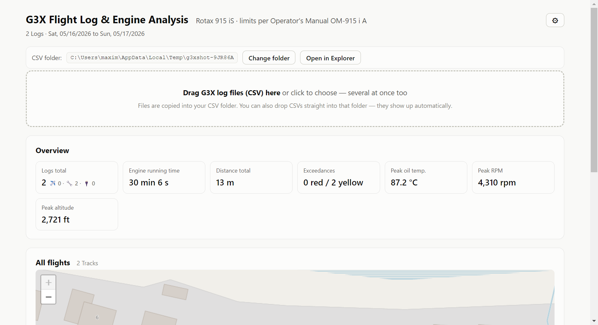

# ✈️ G3X Flight Log

**See what your engine did — in plain, clear numbers.**
A free desktop app that turns the flight logs from your **Garmin G3X** into
easy-to-read charts, maps and warnings. Built around the **Rotax 915 iS**.

**100% on your computer. No cloud, no account, no internet needed.**

 

---

## ⬇️ Download

**[➡️ Download the latest version](../../releases/latest)**

1. On the [releases page](../../releases/latest), download
   **`G3X-Flight-Log-…-win64-portable.zip`**.
2. **Unzip** it anywhere you like (e.g. your Desktop).
3. Open the folder and double-click **`G3X Flight Log.exe`**.

That's it — no installation, no admin rights. *(Windows may show a blue
"Windows protected your PC" notice the first time because the app isn't
code-signed. Click **More info → Run anyway**.)*

Prefer a proper installer with Start-menu entry? A `Setup.exe` is available on
the releases page too.

---

## What it does

- 📂 **Pick one folder** for your CSV logs. Drag & drop files onto the window, or
  just drop them into that folder — they appear automatically.
- 🗂️ **Flight logbook** — every log listed by date, sorted, with filters
  (flights / ground runs / avionics-only, by month, only-with-warnings).
- 🚦 **Traffic-light checks** against the Rotax limits — green / yellow / red for
  RPM, oil & coolant temperature, oil & fuel pressure, EGT, and more, with the
  exact time and peak of every exceedance.
- 🗺️ **Map of every flight** (OpenStreetMap) — hover the track to see height,
  speed, RPM, fuel flow and temperatures for that exact second.
- 📊 **Clear charts** for the whole flight, plus every value the G3X records.
- 🌐 **English or German**, switchable any time.
- 📏 **Choose your units** — °C/°F, psi/bar, ft/m, kt/km-h, and more.
- 🖨️ **Print or save any flight as a PDF** report.

Your files are never moved or changed — the app only reads them. Delete a CSV
from the folder and it disappears from the app; delete it inside the app and the
file is removed from the folder. Simple and predictable.

---

## How to use it

1. **Start the app.** On first run it creates a folder for your logs
   (Documents → *G3X-Flightlog*). You can change it any time with **Change
   folder**.
2. **Add logs.** Copy the `.csv` files from your G3X SD-card into that folder, or
   drag them onto the window.
3. **Open a flight.** Click any entry in the list to see the full report —
   overview tiles, warnings, map and charts.
4. **Settings (⚙️, top right).** Switch **language** and **measurement units**.

---

## Good to know

- **Private by design.** Everything runs on your PC. Nothing is uploaded. The
  only thing fetched from the internet is the background map imagery — and if
  you're offline, the map simply draws the track as an outline instead.
- **Not an official Rotax tool.** The limit values follow the BRP-Rotax
  Operator's Manual OM-915 i A; some intermediate "caution" zones are added by
  this app to warn early. **The current Operator's Manual and your aircraft's
  flight manual always take precedence.**

---

## Support

If this saved you time, a coffee is very welcome 🙏

---

Developer / build it yourself → [TECHNICAL.md](TECHNICAL.md)
